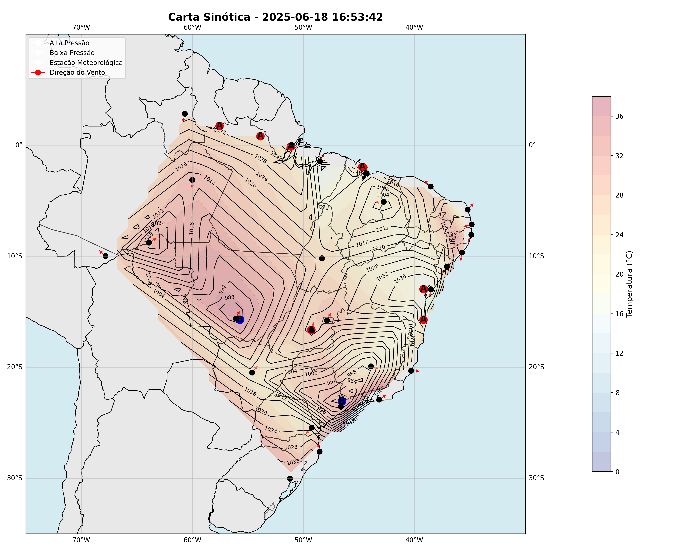
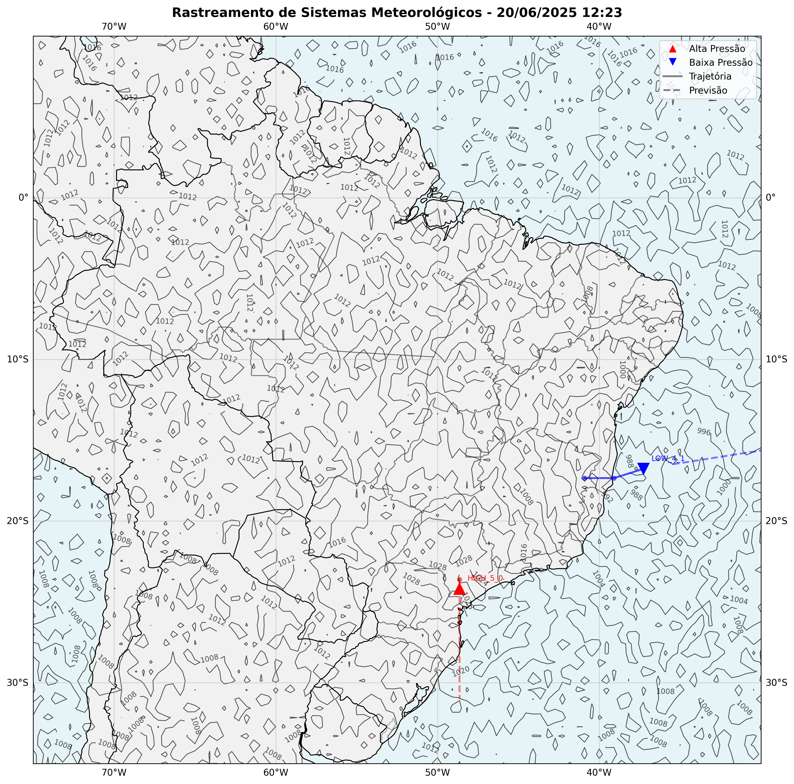
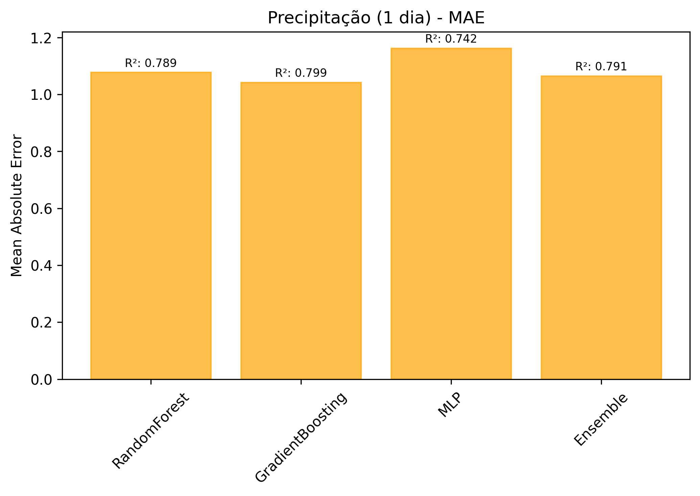
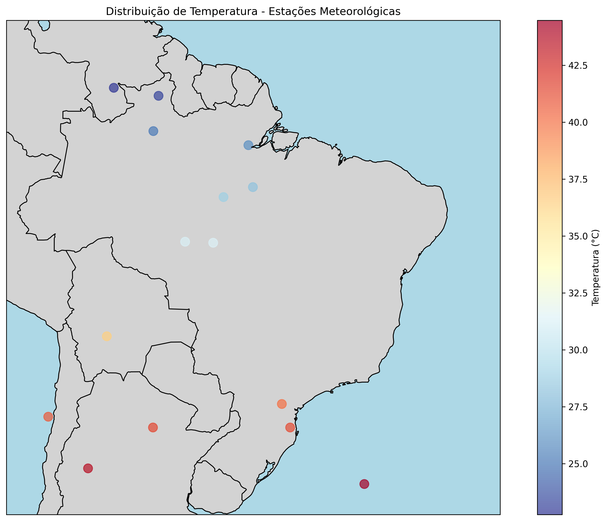
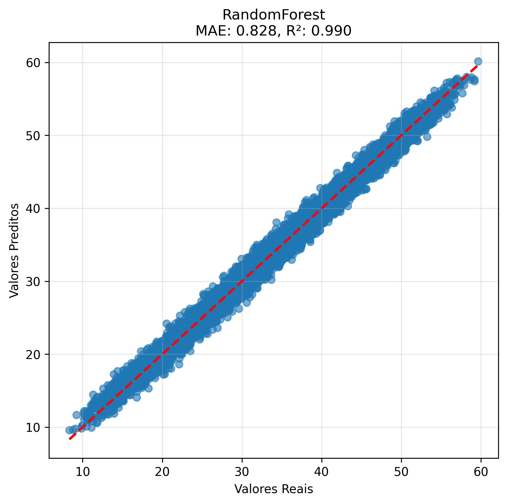
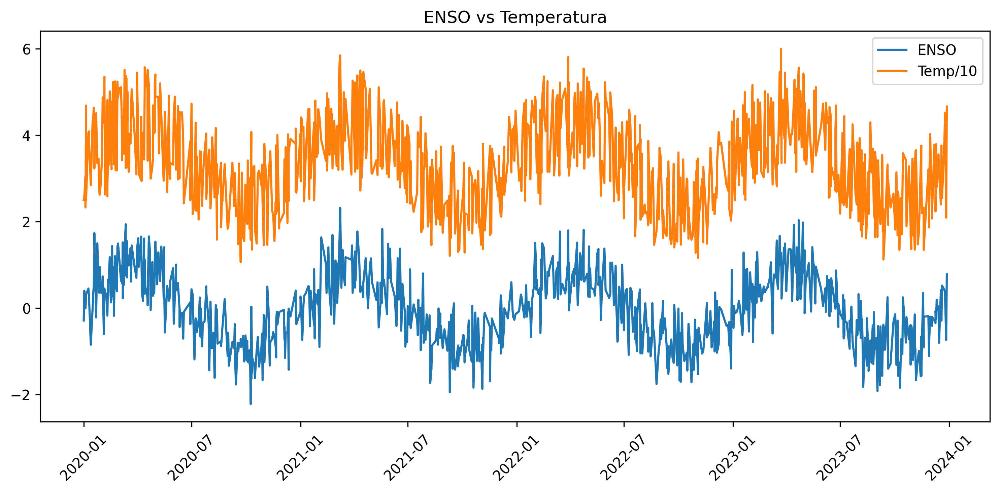
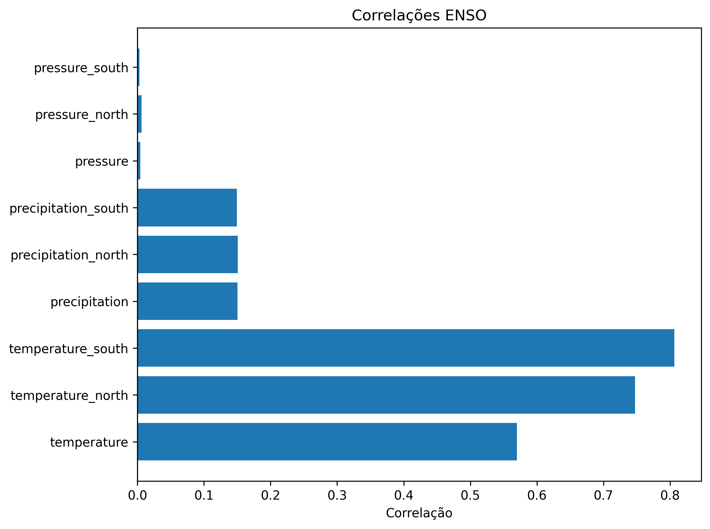

# Aplicações Python em Meteorologia Sinótica

# ** 1 - Synoptic Meteorology Analyzer**  

## **📌 Visão Geral**  

Este projeto é um **Sistema de Análise Sinótica Automatizada** desenvolvido em Python para processar e visualizar dados meteorológicos em escala regional, com foco no território brasileiro. Ele permite:  

- **Coletar dados meteorológicos** de múltiplas cidades (via API OpenWeatherMap ou dados simulados).  
- **Processar e interpolar** campos meteorológicos (pressão, temperatura, vento).  
- **Identificar sistemas de pressão** (altas e baixas pressões).  
- **Gerar cartas sinóticas** (mapas meteorológicos profissionais).  
- **Produzir relatórios automáticos** com análise das condições climáticas.  

É uma ferramenta útil para **meteorologistas, estudantes e entusiastas** que desejam automatizar a análise do tempo em diferentes regiões.  

---

## **🔧 Funcionalidades Detalhadas**  

### **1. Coleta de Dados Meteorológicos**  
- **Fonte de dados**:  
  - **OpenWeatherMap API** (requer chave de acesso).  
  - **Modo simulado** (gera dados aleatórios para testes).  
- **Variáveis coletadas**:  
  - Temperatura (°C)  
  - Pressão atmosférica (hPa)  
  - Umidade relativa (%)  
  - Velocidade e direção do vento (m/s, graus)  

### **2. Processamento de Dados**  
- **Interpolação espacial**:  
  - Converte dados pontuais (estações meteorológicas) em campos contínuos usando interpolação linear.  
  - Gera grades regulares para visualização em mapas.  
- **Detecção de sistemas de pressão**:  
  - Identifica **centros de alta pressão (A)** e **baixa pressão (B)** automaticamente.  
  - Filtra mínimos e máximos locais para evitar falsos positivos.  

### **3. Visualização com Cartas Sinóticas**  
- **Mapa base**:  
  - Limites geopolíticos (estados, países, costa).  
  - Relevo simplificado (terra e oceano).  
- **Elementos meteorológicos plotados**:  
  - **Isóbaras** (linhas de pressão atmosférica).  
  - **Campos de temperatura** (preenchimento colorido).  
  - **Direção do vento** (setas indicativas).  
  - **Posição das estações meteorológicas** (pontos pretos).  
  - **Centros de pressão** (A = Alta, B = Baixa).  

### **4. Relatório Meteorológico Automático**  
- **Estatísticas gerais**:  
  - Médias de temperatura, pressão, umidade e vento.  
- **Análise de sistemas de pressão**:  
  - Quantidade, posição e intensidade de altas/baixas pressões.  
- **Condições por cidade**:  
  - Detalhamento das variáveis meteorológicas em cada local.  

---

## **📦 Dependências**  

| Biblioteca | Função |
|------------|--------|
| `requests` | Requisições HTTP à API OpenWeatherMap |
| `pandas` | Manipulação de dados em DataFrames |
| `numpy` | Cálculos numéricos e álgebra linear |
| `matplotlib` | Geração de gráficos e mapas |
| `cartopy` | Visualização geográfica (projeções, mapas) |
| `scipy` | Interpolação e filtragem de dados |
| `datetime` | Manipulação de datas e horários |

---

## **🚀 Como Usar**  

### **1. Configuração Inicial**  
- Instale as dependências:  
  ```bash
  pip install requests pandas numpy matplotlib cartopy scipy
  ```
- Para usar a **API OpenWeatherMap**, insira sua chave:  
  ```python
  analyzer = SynopticMeteorologyAnalyzer(api_key='SUA_CHAVE_API')
  ```
- **Sem chave API?** O sistema usará **dados simulados** automaticamente.  

### **2. Execução**  
Execute o script principal (`main.py` ou o arquivo correspondente). Os resultados serão salvos em:  
- **`resultados/carta_sinotica.png`** → Mapa meteorológico.  
- **`resultados/relatorio_meteorologico.txt`** → Análise textual.  

### **3. Personalização**  
- **Adicionar/remover cidades**:  
  Edite a lista em `get_weather_data()`.  
- **Ajustar parâmetros de interpolação**:  
  Modifique `grid_size` em `interpolate_field()`.  
- **Alter estilo do mapa**:  
  Personalize cores e elementos em `create_synoptic_chart()`.  

---

## **📊 Exemplo de Saída**  

### **Carta Sinótica**  
  

### **Relatório Meteorológico**  
```plaintext
RELATÓRIO METEOROLÓGICO - 2023-11-15 14:30:00  
============================================  

CONDIÇÕES GERAIS:  
- Temperatura Média: 24.8 °C  
- Pressão Média: 1013.5 hPa  
- Umidade Média: 72.1%  
- Vento Médio: 5.3 m/s  

SISTEMAS DE PRESSÃO IDENTIFICADOS (2):  
1. ALTA PRESSÃO (A)  
   - Local: 12.5°S, 45.2°W  
   - Pressão: 1028 hPa  
2. BAIXA PRESSÃO (B)  
   - Local: 22.1°S, 50.8°W  
   - Pressão: 1002 hPa  

CONDIÇÕES POR CIDADE:  
► São Paulo:  
   - Temp: 22.1°C | Pressão: 1015 hPa  
   - Vento: 4.2 m/s (120°)  
► Rio de Janeiro:  
   - Temp: 26.5°C | Pressão: 1012 hPa  
   - Vento: 6.1 m/s (80°)  
...
```

---

## **📌 Aplicações**  
✔ **Previsão do tempo simplificada**  
✔ **Estudos em meteorologia sinótica**  
✔ **Aulas e demonstrações em climatologia**  
✔ **Análise de padrões atmosféricos regionais**  

---

# **2 - Weather System Tracker**



## Descrição

O Weather System Tracker é um sistema de detecção e rastreamento de sistemas meteorológicos que utiliza técnicas de processamento de dados e aprendizado de máquina para identificar e monitorar sistemas de alta e baixa pressão, bem como frentes meteorológicas.

---

## Funcionalidades Principais

- **Geração de campos meteorológicos sintéticos**:
  - Campos de pressão atmosférica simulando ciclones e anticiclones
  - Campos de temperatura com frentes frias e quentes

- **Detecção de sistemas meteorológicos**:
  - Identificação de sistemas de alta e baixa pressão
  - Detecção de frentes meteorológicas usando gradientes de temperatura
  - Clusterização de pontos de frente usando DBSCAN

- **Rastreamento temporal**:
  - Associação de sistemas entre passos de tempo
  - Cálculo de trajetórias e velocidades
  - Previsão de trajetórias futuras

- **Geração de alertas**:
  - Classificação de intensidade (WATCH, MODERATE, SEVERE)
  - Relatórios detalhados de sistemas

- **Visualização**:
  - Mapas com projeção cartográfica
  - Trajetórias e previsões plotadas
  - Campos de pressão com curvas de nível

---

## Requisitos

- Python 3.7+
- Bibliotecas necessárias:
  - numpy
  - pandas
  - matplotlib
  - cartopy
  - scipy
  - scikit-learn

Instale as dependências com:
```bash
pip install numpy pandas matplotlib cartopy scipy scikit-learn
```

---

## Como Usar

1. **Inicialização**:
```python
tracker = WeatherSystemTracker()
```

2. **Geração de dados sintéticos**:
```python
lon_mesh, lat_mesh, pressure_field = tracker.generate_synthetic_pressure_field(time_step)
```

3. **Detecção de sistemas**:
```python
systems = tracker.detect_pressure_systems(lon_mesh, lat_mesh, pressure_field)
fronts = tracker.detect_fronts(lon_mesh, lat_mesh, temperature_field)
```

4. **Rastreamento**:
```python
tracked_systems = tracker.track_systems(systems, time_step)
```

5. **Visualização**:
```python
fig = tracker.visualize_tracking(lon_mesh, lat_mesh, pressure_field, tracked_systems)
```

6. **Relatórios**:
```python
report = tracker.generate_tracking_report(tracked_systems, alerts)
```

---

## Exemplo Completo

O arquivo principal inclui uma simulação completa que:
1. Gera 8 passos de tempo de dados sintéticos
2. Detecta e rastreia sistemas meteorológicos
3. Gera relatórios e gráficos
4. Produz estatísticas finais

Para executar a simulação completa:
```bash
python weather_tracker.py
```

---

## Saídas Geradas

- **tracking_step_XX.png**: Gráficos de rastreamento em cada passo de tempo
- **relatorios_rastreamento.txt**: Relatórios detalhados de cada passo
- **estatisticas_sistemas.txt**: Análise estatística final

---

## Métodos Principais

| Método | Descrição |
|--------|-----------|
| `generate_synthetic_pressure_field` | Gera campo de pressão com sistemas móveis |
| `generate_synthetic_temperature_field` | Gera campo de temperatura com frentes |
| `detect_pressure_systems` | Identifica altas e baixas pressões |
| `detect_fronts` | Detecta frentes usando gradientes térmicos |
| `track_systems` | Associa sistemas entre passos de tempo |
| `predict_trajectory` | Prevê trajetórias futuras |
| `generate_alerts` | Gera alertas baseados em intensidade |
| `visualize_tracking` | Plota mapas com sistemas e trajetórias |
| `generate_tracking_report` | Produz relatório textual |

## Estrutura de Dados

Os sistemas meteorológicos são representados como dicionários com:
- `type`: 'HIGH' ou 'LOW'
- `lat`, `lon`: Coordenadas
- `pressure`: Valor de pressão
- `intensity`: Intensidade relativa
- `track`: Histórico de posições
- `id`: Identificador único

---

## Personalização

Parâmetros ajustáveis:
- `tracking_threshold`: Distância máxima para associação (km)
- Limiares de detecção em `detect_pressure_systems` e `detect_fronts`
- Parâmetros de visualização em `visualize_tracking`

---

## Limitações

- Dados sintéticos simplificados
- Modelo de previsão de trajetória básico
- Região fixa (América do Sul)


---

# 3 - Plataforma de Previsão Sinótica com Machine Learning


Uma plataforma avançada para previsão meteorológica utilizando técnicas de Machine Learning, capaz de gerar previsões de temperatura, pressão e precipitação com até 3 dias de antecedência.

## 📌 Visão Geral

Este projeto implementa um sistema completo de previsão meteorológica que combina:
- Modelos ensemble de Machine Learning (Random Forest, Gradient Boosting e MLP)
- Redes neurais LSTM para análise de séries temporais
- Análise de teleconexões climáticas (ENSO, NAO)
- Visualização geoespacial de dados meteorológicos
- Interface web para interação com o usuário

## 🚀 Funcionalidades Principais

- **Geração de dados sintéticos** para simulação de condições meteorológicas
- **Previsão multivariada** (temperatura, pressão, precipitação)
- **Horizontes de previsão** (1 dia e 3 dias)
- **Análise de teleconexões** entre padrões climáticos globais e condições locais
- **Visualização automática** de resultados e métricas de desempenho
- **Interface web integrada** para teste dos modelos
- **Processamento de dados reais** (formato NOAA)

## 📦 Estrutura do Código

O projeto está organizado em três classes principais:

1. **`SynopticMLForecast`**: Classe principal que implementa toda a lógica de previsão
   - Geração de dados sintéticos
   - Treinamento de modelos
   - Análise de teleconexões
   - Visualização de resultados

2. **`ForecastWebInterface`**: Interface web baseada em Flask para interação com o usuário
   - Formulário HTML para entrada de dados
   - Exibição de previsões
   - Geração automática de relatório HTML

3. **`WeatherDataProcessor`**: Utilitário para processamento de dados reais
   - Carregamento de arquivos CSV
   - Adaptação de formato NOAA
   - Cálculo de variáveis derivadas

## 🛠️ Instalação e Uso

### Pré-requisitos
- Python 3.7+
- Bibliotecas listadas em `requirements.txt`

```bash
pip install -r requirements.txt
```

### Executando o exemplo principal

```python
python3 forecastSynopticML.py
```

Isso irá:
1. Gerar dados sintéticos
2. Treinar todos os modelos
3. Realizar análises de teleconexões
4. Gerar visualizações
5. Salvar o modelo treinado

### Usando a interface web

```python
from synoptic_forecast import SynopticMLForecast, ForecastWebInterface

# Inicializar sistema
forecast_system = SynopticMLForecast()

# Carregar modelo pré-treinado ou treinar novo
forecast_system.load_model('synoptic_forecast_model')

# Iniciar interface web
web_interface = ForecastWebInterface(forecast_system)
web_interface.run()
```

Acesse `http://127.0.0.1:8080` no seu navegador.

## 📊 Saídas Geradas







O sistema gera automaticamente na pasta `resultados_forecastSynopticML`:
- Gráficos de desempenho dos modelos
- Mapas geográficos com distribuição das variáveis
- Análises de correlação com teleconexões
- Relatório JSON completo (`forecast_report.json`)
- Modelos treinados (arquivos `.joblib` e metadados JSON)

## 🔍 Métricas de Desempenho

Os modelos são avaliados usando:
- **MAE (Mean Absolute Error)**
- **MSE (Mean Squared Error)**
- **R² (Coeficiente de Determinação)**

Exemplo de saída:
```
Treinando modelos para temp_1d...
  RandomForest - MAE: 0.701, R²: 0.962
  GradientBoosting - MAE: 0.723, R²: 0.959
  MLP - MAE: 0.735, R²: 0.957
  Ensemble - MAE: 0.692, R²: 0.964
```

## 🌐 Teleconexões Analisadas

O sistema calcula correlações entre:
- **ENSO (El Niño Southern Oscillation)**
- **NAO (North Atlantic Oscillation)**
  
Com variáveis meteorológicas locais (temperatura, pressão, precipitação), incluindo análises regionais (Norte/Sul).

## 📁 Estrutura de Arquivos

```
├── synoptic_forecast.py          # Código principal
├── requirements.txt              # Dependências
├── resultados_forecastSynopticML # Pasta de saídas
│   ├── forecast_*.png            # Gráficos de previsão
│   ├── teleconnection_*.png      # Análises de teleconexões
│   ├── geographic_*.png          # Mapas geográficos
│   └── forecast_report.json      # Relatório completo
├── synoptic_forecast_model_metadata.json  # Metadados do modelo
└── *.joblib                      # Modelos treinados
```

## 🤝 Contribuição

Contribuições são bem-vindas! Siga os passos:
1. Faça um fork do projeto
2. Crie sua branch (`git checkout -b feature/AmazingFeature`)
3. Commit suas mudanças (`git commit -m 'Add some AmazingFeature'`)
4. Push para a branch (`git push origin feature/AmazingFeature`)
5. Abra um Pull Request


## **📜 Licença**  
Este projeto é open-source (MIT). Sinta-se à vontade para **contribuir, modificar e distribuir**!  

🔗 **GitHub**: [MeuRepositório](https://github.com/brjatoba92/met_sin_python)  
📧 **Contato**: [E-mail](brunojatobadev@gmail.com)  

--- 

**🌟 Dúvidas? Sugestões? Abra uma *issue* ou contribua!**